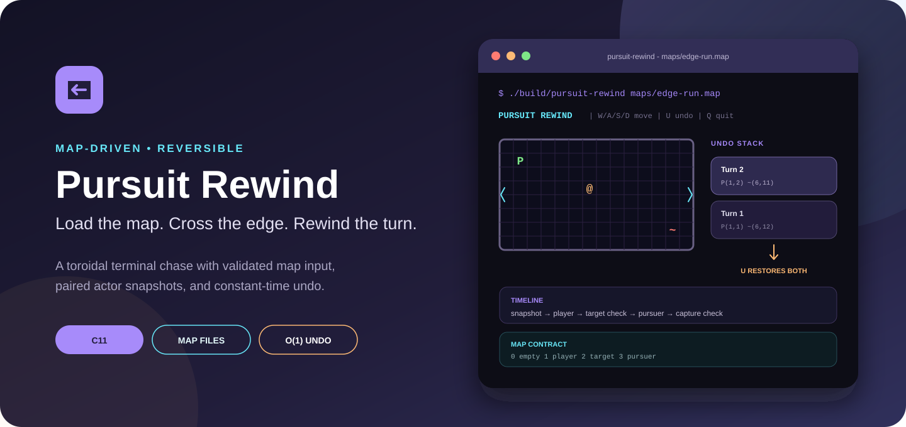
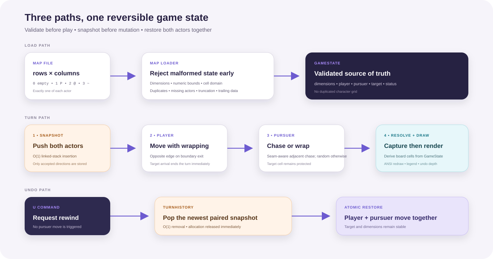

  

  
  
  
  
  

  <strong>Load the map. Cross the edge. Rewind the turn.</strong> 
  A map-driven terminal chase with validated input, wraparound movement, and
  paired actor snapshots.

---

## Why Pursuit Rewind

Pursuit Rewind takes a small chase loop and makes state transitions visible.
Every accepted direction first records both actors, then moves the player,
resolves immediate victory, advances the pursuer when needed, and checks for
capture. The U command reverses that entire accepted turn in one operation.

The result is a compact C project centered on three concrete engineering ideas:
defensive file parsing, toroidal coordinate rules, and an ownership-safe linked
history stack.

### Product highlights

- <strong>Map-defined sessions</strong> — dimensions and actor positions come
  from a plain-text contract.
- <strong>Fail-fast validation</strong> — malformed dimensions, cell values,
  duplicates, missing actors, truncation, and trailing data are rejected.
- <strong>Toroidal movement</strong> — crossing an edge re-enters from the
  opposite side.
- <strong>Atomic undo</strong> — player and pursuer positions are restored
  together from an O(1) LIFO stack.
- <strong>Immediate victory</strong> — reaching the target ends the turn before
  the pursuer moves.
- <strong>Local execution</strong> — no external dependencies, network calls,
  saved data, or shell commands.

## Build and play

### Prerequisites

- Clang or GCC with C11 support
- POSIX <code>termios</code>
- <code>make</code>

Linux and macOS are verified in CI.

### Build

~~~bash
git clone https://github.com/Himath2002/pursuit-rewind-c.git
cd pursuit-rewind-c
make
~~~

The executable is generated at <code>build/pursuit-rewind</code>.

### Start a session

~~~bash
./build/pursuit-rewind maps/classic.map
~~~

Try the edge-focused map:

~~~bash
./build/pursuit-rewind maps/edge-run.map
~~~

### Controls

| Key | Action |
| --- | --- |
| W | Move up, wrapping from top to bottom |
| A | Move left, wrapping from left to right |
| S | Move down, wrapping from bottom to top |
| D | Move right, wrapping from right to left |
| U | Restore the most recent accepted turn |
| Q | End the session cleanly |

Uppercase and lowercase input are accepted. An invalid key does not create a
history entry or advance the pursuer.

## Map contract

A map begins with <code>rows columns</code>, followed by exactly
<code>rows × columns</code> integer cells:

| Value | Meaning | Required count |
| ---: | --- | ---: |
| 0 | Empty cell | Any |
| 1 | Player | Exactly 1 |
| 2 | Target | Exactly 1 |
| 3 | Pursuer | Exactly 1 |

Example:

~~~text
5 7
1 0 0 0 0 0 0
0 0 0 0 0 0 0
0 0 0 2 0 0 0
0 0 0 0 0 0 0
0 0 0 0 0 0 3
~~~

Dimensions must contain 5-60 rows and 5-160 columns. Extra cells and nonnumeric
trailing data are rejected instead of being silently ignored.

## Architecture

  

### Accepted turn

~~~text
push(player, pursuer)
        │
        ▼
move player with wrapping
        │
        ├── target reached? → finish immediately
        │
        ▼
move pursuer: adjacent chase or random wrapped step
        │
        ▼
resolve capture → render
~~~

### Undo model

<code>TurnHistory</code> is a purpose-built linked stack. Each node stores one
<code>TurnSnapshot</code> containing the player and pursuer positions. Push and
pop both operate at the head, so history insertion and restoration remain O(1).

The target and map dimensions never change during a session, so they do not
need to be duplicated in every snapshot.

### Module responsibilities

| Module | Responsibility |
| --- | --- |
| <code>map_loader.c</code> | Parse and validate the complete map contract |
| <code>game.c</code> | Dimensions, position rules, status precedence, messages |
| <code>history.c</code> | Snapshot allocation, O(1) push/pop, deterministic cleanup |
| <code>movement.c</code> | Player wrapping and pursuer movement policy |
| <code>terminal.c</code> | Immediate key input with terminal restoration |
| <code>renderer.c</code> | Derived board, timeline notices, symbols, undo depth |
| <code>main.c</code> | Command routing and accepted-turn orchestration |

## Complexity and ownership

| Operation | Complexity | Memory behavior |
| --- | ---: | --- |
| Map parsing | O(rows × columns) | Constant-size decoded state |
| Frame rendering | O(rows × columns) | No board allocation |
| Player or pursuer move | O(1) | In-place coordinates |
| History push | O(1) | One owned snapshot node |
| Undo | O(1) | Pops and frees one node |
| Shutdown | O(turns retained) | Frees every remaining snapshot |

## Verification

Run the complete local quality gate:

~~~bash
make clean all check
~~~

The build uses:

~~~text
-std=c11 -Wall -Wextra -Wpedantic -Werror
~~~

Focused checks verify:

- the included classic map and decoded actor positions;
- duplicate, truncated, and invalid-cell rejection;
- horizontal and vertical player wrapping;
- wrapped pursuer movement and target-cell protection;
- adjacent pursuit;
- LIFO history restoration of both actors;
- target-arrival precedence.

CI repeats the build and checks on Ubuntu and macOS.

## Project structure

~~~text
pursuit-rewind-c/
├── .github/workflows/ci.yml
├── docs/
│   ├── architecture.svg
│   └── hero.svg
├── include/pursuit_rewind/
│   ├── game.h
│   ├── history.h
│   ├── map_loader.h
│   ├── movement.h
│   ├── random_source.h
│   ├── renderer.h
│   └── terminal.h
├── maps/
│   ├── classic.map
│   └── edge-run.map
├── src/
│   ├── game.c
│   ├── history.c
│   ├── main.c
│   ├── map_loader.c
│   ├── movement.c
│   ├── random_source.c
│   ├── renderer.c
│   └── terminal.c
├── tests/
│   ├── fixtures/
│   └── test_suite.c
├── Makefile
└── README.md
~~~

## Scope

Pursuit Rewind targets ANSI-compatible POSIX terminals. Obstacles, replay
files, persistent scores, Windows Console support, and configurable pursuer
policies are outside this focused release.

## Provenance

This edition preserves the original map, wrapping, pursuit, and undo concepts
while replacing earlier utility snippets and the generic tail-removal list with
repository-owned, purpose-specific implementations. See
[ACKNOWLEDGEMENTS.md](ACKNOWLEDGEMENTS.md).

Release history is recorded in [CHANGELOG.md](CHANGELOG.md).

## License

Released under the [MIT License](LICENSE).

---

  Designed and engineered by <a href="https://github.com/Himath2002">Himath Ahangama</a>.

